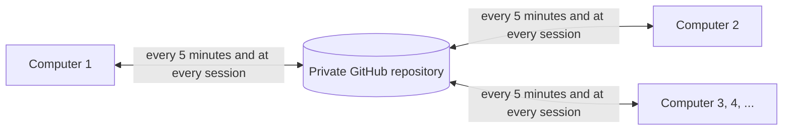

[Leia em português](README.pt-BR.md)

# claude-sync

Keeps Claude Code identical on every Windows computer of one person: memory, `CLAUDE.md`, rules, skills,
agents, commands, settings, MCP servers, plugins and every conversation. A private GitHub repository
carries it all, and each computer syncs with it by itself, in the background, with no window and nothing
for the person to do.

It is one self-contained file, `claude-sync.cmd`, that needs only Node.js and Git.

## How it works



- The computers never talk to each other. The repository is the bridge, so one of them can stay off for
  weeks and catch up by itself when it comes back.
- Two triggers, each one repairing the other: a Windows scheduled task (at logon and every 5 minutes)
  and four Claude Code hooks (session start, a write inside `~/.claude`, end of turn, end of session).
- The person sees nothing, except one plain sentence from Claude when something arrived from another
  computer. Claude also offers to install programs installed elsewhere, says who to call if the sync
  keeps failing, and asks once before moving to a new repository when this one fills up.

## Setting up a new person

This repository holds the **clean copy**: `claude-sync.cmd` with no address and no key inside. Every
new setup starts from it.

1. **First computer:** open Claude Code, give it the address of this repository and ask it to set up
   claude-sync. Claude guides the setup with the person present: a GitHub account, an organization
   dedicated to the sync, a private repository inside it, and a classic access key for this computer.
   Then it installs and uploads everything.
2. **At the end, the package for the second computer is on the Desktop:** `claude-sync-computer-2.zip`,
   with this documentation and a `claude-sync.cmd` that already holds the address of the person's
   repository.
3. Take the zip to the second computer (USB drive or shared folder) and unzip it there.
4. **Second computer:** open Claude Code and ask it to run `claude-sync.cmd setup --print` from the
   unzipped folder, or double click that file. It knows it is the second computer, so Claude only asks
   the person to sign in to the same GitHub account and create this computer's key. Then it installs
   and brings everything over.
5. **Third computer and beyond:** the same zip and the same steps as the second. Each computer gets its
   own key and its own name (`--name`), so Claude can say which computer a change came from.
6. Done. Every computer stays in sync from then on, with nobody touching them.

**For Claude Code on the first computer.** Download this repository into the temporary folder and run
the file from there, in PowerShell:

```powershell
$ProgressPreference = 'SilentlyContinue'
$dir = Join-Path $env:TEMP 'claude-sync-setup'
Remove-Item $dir -Recurse -Force -ErrorAction SilentlyContinue
New-Item -ItemType Directory $dir | Out-Null
Invoke-WebRequest 'https://github.com/abajur-ai/claude-sync/archive/refs/heads/main.zip' -OutFile "$dir\download.zip" -UseBasicParsing
Expand-Archive "$dir\download.zip" $dir
& (Get-ChildItem $dir -Recurse -Filter claude-sync.cmd | Select-Object -First 1).FullName setup --print
```

Then follow the runbook it prints, step by step. Nothing is saved on the Desktop by hand: the install
keeps what it needs in its own folder and leaves only the zip there.

- Every computer after the first needs the zip from the first one, not a fresh download: a clean copy
  starts the setup from scratch. If that happens, type the address:
  `claude-sync.cmd install --repo https://github.com/<organization>/claude-sync --name "Two" --token <key>`
- `remember --carry-token` puts the key inside the file and the zip too, so the next computer needs
  no browser step at all. From that moment the zip is a key: USB drive only, and delete every copy
  once the last computer is set up.
- What already exists on a joining computer is kept: files only it has go up to the repository, and
  a file that differs keeps the version already in the repository, with the local one saved as a
  conflict copy.

## Requirements

| Item | What is needed |
|---|---|
| Windows | tested on Windows 11 |
| Claude Code | opened at least once, so the `~/.claude` folder exists |
| Node.js | the LTS version; if it is missing, the file prints the `winget` command that installs it |
| Git | 2.31 or newer; the guided setup installs it when missing |
| GitHub | an account, an organization for the sync, a private repository inside it, and one classic key per computer with the `repo` scope |

A classic key reaches every repository of its owner, which is what lets the sync move to a new
repository by itself. A fine-grained key limited to chosen repositories cannot do that, and in a new
organization it waits for administrator approval. If the key page cannot be completed,
`gh auth login --scopes repo` followed by `gh auth token` gives a key that works the same way.

## Commands

| Command | What it does |
|---|---|
| `claude-sync.cmd` | guided setup, or a sync if this computer is already set up |
| `setup --print` | prints the runbook that Claude Code follows |
| `install --repo <url> --name <label> [--token <key>] [--support <name>] [--no-task]` | installs; creates the repository as private if it does not exist, and refuses a public one |
| `remember [--repo <url>] [--login <login>] [--carry-token] [--token <key>]` | writes the address, and optionally a key, into the file to be carried, and saves `claude-sync-computer-2.zip` on the Desktop again |
| `sync [--force] [--scan-programs] [--quiet] [--check-size]` | syncs now |
| `rotate [--yes] [--later] [--repo <url>] [--keep-days <n>] [--keep-all]` | moves the sync to a new repository |
| `status` | health report |
| `uninstall` | removes the scheduled task, the hooks, the note in `CLAUDE.md` and the stored key; keeps `~/.claude` and the repository |

- After the install, run any command through `"%USERPROFILE%\.claude-sync\claude-sync.cmd"`, which
  does not need Node on the PATH. In PowerShell, put `&` in front.
- Never put `cmd /c` in front in the Bash shell that Claude Code uses: `/c` turns into a path and
  `cmd` opens an interactive window that answers nothing.
- `--support <name>` is who the person should call if the sync stops; Claude says that name instead
  of trying to repair anything.
- `remember --carry-token --token <key>` carries a different key, such as the next computer's own.

## Checking it

`"%USERPROFILE%\.claude-sync\claude-sync.cmd" status`

- `Health` says `ok`, or says what needs attention.
- `Scheduled task` says `registered`, never `REGISTERED BUT DISABLED`.
- `Claude Code hooks` says `4 of 4 in place`.
- `Still to upload` says `nothing` once a large history has finished going up.
- `Repository size` is measured by GitHub twice a day (`sync --check-size` measures it right away).

## What is synced

- **Synced:** `CLAUDE.md`, `rules`, `skills`, `agents`, `commands`, `output-styles`, `workflows`,
  `themes`, `agent-memory`, `keybindings.json`, `settings.json`, the auto memory of every project,
  every conversation, user scope MCP servers and the list of enabled plugins.
- **Not synced:** the Claude Code login (`.credentials.json` never leaves the computer), caches, logs,
  temporary state and anything machine specific.
- **Programs** installed with winget, npm or pip are reported to Claude on the other computers, which
  install them with the person present.

## Conflicts

- The same file edited on more than one computer: the newest edit wins, and the other is kept in
  `%USERPROFILE%\.claude-sync\conflicts\`. Nothing is lost silently.
- `MEMORY.md`: the lines of every computer are merged.
- A conversation that grew on more than one computer: the longer one wins, the other is kept as a
  conflict copy.
- A conversation open in Claude Code right now is never overwritten.
- If most tracked files disappear on one computer, the sync stops and changes nothing.

## When the repository fills up

GitHub asks repositories to stay under about 1 GB. Twice a day the sync asks GitHub how big the
repository is, and past 800 MB Claude asks the person, once, whether it can move to a new one. Only a
yes starts the move; "not now" asks again in a month.

1. The computer that moves gets fully up to date with the current repository.
2. It creates a new private repository next to it, under the same owner (`<name>-2`, then `<name>-3`).
3. It fills it with everything, except conversations not used in the last 180 days, judged by the
   dates inside each conversation.
4. Only then it leaves a note, `moved.json`, in the current repository saying where the sync went.

- Every other computer finds the note on its next sync and follows by itself, keeping what it changed
  in the meantime. A computer off through several moves follows the whole chain at once.
- A computer that cannot follow sends nothing to the old repository: its changes wait, untouched, and
  Claude tells the person who to call.
- A move stopped halfway, by a closed laptop or a dropped connection, resumes where it stopped.
- Nothing is deleted. Old conversations stay on every computer and in the old repository, and one that
  is picked up again travels again. **Keep the old repository:** it is what tells a computer that was
  off, or an old carried file, where the sync went.
- By hand: `rotate` explains and changes nothing, `rotate --yes` moves, `rotate --later` asks again in
  a month. `--keep-days <n>` changes the 180 days, `--keep-all` carries everything, and `--repo <url>`
  names the new repository (empty, same owner).

## Where it lives

- Everything stays in `%USERPROFILE%\.claude-sync\`, next to the `.claude` folder of Claude Code: the
  program, the local copy of the repository, `sync.log` (access keys redacted) and `conflicts\`.
- The access key is protected by Windows and readable only by that Windows user.
- The setup download stays in the temporary folder. The only thing left on the Desktop is
  `claude-sync-computer-2.zip`, on the first computer, which can be deleted once the other computers are
  set up; `remember` saves it again when another computer joins later.

## Working on the code

- `claude-sync.cmd` is `src/claude-sync.mjs` packed behind a batch header. Edit the source and repack
  with `node src\build-cmd.mjs`; never edit the `.cmd` by hand, and commit both.
- `.gitattributes` keeps every file byte for byte, so what people download is exactly what was tested.

## Tests

Throwaway computers in the temp folder and throwaway GitHub repositories. They never touch the Claude
Code of the computer that runs them.

| Suite | What it proves |
|---|---|
| `tests\run-tests.mjs` | two isolated computers, the whole behaviour |
| `tests\three-computers-test.mjs` | three computers on one repository: joins, edits, deletions, conflicts, `MEMORY.md` and convergence |
| `tests\setup-tests.mjs` | the single file, the runbook, the guided install and the zip for the second computer |
| `tests\installer-guard-test.mjs` | the guards in the `.cmd` header |
| `tests\rotation-tests.mjs` | moving to a new repository, and the other computer following |
| `tests\chaos-tests.mjs` | random edits on both sides with injected faults, judged by an oracle |
| `tests\e2e-claude.mjs` | real Claude Code sessions (uses your Claude subscription) |
| `tests\second-machine-test.mjs` | a second real Windows machine, with a watcher that fails on any window |

- `CLAUDE_SYNC_TEST_REPO=<owner>/<throwaway-repo>`: that repository, and every one whose name starts
  with it and a dash, is **deleted and recreated on every run**. An organization made for testing covers
  the real layout.
- `CLAUDE_SYNC_TEST_MACHINE_TOKEN_FILES=<file A>,<file B>`: one classic `repo` key per computer, as in
  a real setup. Without it every computer uses `gh auth token` (or `CLAUDE_SYNC_TEST_TOKEN`), which also
  creates and deletes the test repositories and so needs the `delete_repo` scope.
- Chaos: `CHAOS_ROUNDS`, `CHAOS_SEED` (the same seed replays the same run), `CHAOS_REMOTE` (GitHub
  instead of a local repository, which adds moves to new repositories) and `CHAOS_MOVE_WEIGHT`.
  `CLAUDE_SYNC_TEST_ROOT` separates two runs at the same time.
- Second machine: `CLAUDE_SYNC_VM_VMX`, `CLAUDE_SYNC_VM_USER`, `CLAUDE_SYNC_VM_PASSWORD` and, for an
  encrypted virtual machine, `CLAUDE_SYNC_VM_ENCRYPTION_PASSWORD`. That machine needs portable Node and
  Git in `C:\Users\Public\ccsync`; without the variables the suite says what it needs and skips.

## License

[MIT](LICENSE).
