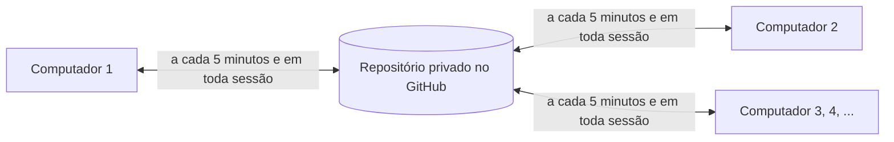

[Read in English](README.md)

# claude-sync

Mantém o Claude Code idêntico em todos os computadores com Windows de uma mesma pessoa: memória,
`CLAUDE.md`, regras, skills, subagentes, comandos, configurações, servidores MCP, plugins e todas as
conversas. Um repositório privado no GitHub carrega tudo, e cada computador sincroniza com ele sozinho,
em segundo plano, sem abrir janela e sem a pessoa precisar fazer nada.

É um arquivo só, o `claude-sync.cmd`, que precisa apenas do Node.js e do Git.

## Como funciona



- Os computadores nunca falam um com o outro. O repositório é a ponte, então um deles pode ficar
  desligado por semanas e se atualizar sozinho quando voltar.
- Dois gatilhos, e um conserta o outro: uma tarefa agendada do Windows (no logon e a cada 5 minutos) e
  quatro ganchos do Claude Code (início de sessão, gravação dentro de `~/.claude`, fim de cada resposta e
  fim de sessão).
- A pessoa não vê nada, a não ser uma frase simples do Claude quando algo chegou de outro computador. O
  Claude também oferece instalar programas instalados nos outros, diz com quem falar se a sincronização
  continuar falhando e pergunta uma única vez antes de mudar para um repositório novo quando este encher.

## Configurando uma pessoa nova

Este repositório guarda a **cópia virgem**: o `claude-sync.cmd` sem endereço e sem chave dentro. Toda
configuração nova começa por ela.

1. **Primeiro computador:** abra o Claude Code, passe o endereço deste repositório e peça para ele
   configurar o claude-sync. O Claude conduz a configuração com a pessoa presente: uma conta no GitHub,
   uma organização dedicada à sincronização, um repositório privado dentro dela e uma chave de acesso
   clássica para este computador. Depois instala e sobe tudo.
2. **No fim, o pacote do segundo computador está na Área de Trabalho:** `claude-sync-computer-2.zip`,
   com esta documentação e um `claude-sync.cmd` que já guarda o endereço do repositório da pessoa.
3. Leve o zip para o segundo computador (pendrive ou pasta compartilhada) e descompacte lá.
4. **Segundo computador:** abra o Claude Code e peça para ele rodar `claude-sync.cmd setup --print` da
   pasta descompactada, ou dê duplo clique nesse arquivo. Ele sabe que é o segundo computador, então o
   Claude só pede para a pessoa entrar na mesma conta do GitHub e criar a chave deste computador.
   Depois instala e traz tudo.
5. **Terceiro computador em diante:** o mesmo zip e os mesmos passos do segundo. Cada computador tem a
   própria chave e o próprio nome (`--name`), para o Claude dizer de qual computador veio cada mudança.
6. Pronto. Daí em diante todos os computadores ficam sincronizados sozinhos, sem ninguém mexer.

**Para o Claude Code do primeiro computador.** Baixe este repositório na pasta temporária e rode o
arquivo de lá, no PowerShell:

```powershell
$ProgressPreference = 'SilentlyContinue'
$dir = Join-Path $env:TEMP 'claude-sync-setup'
Remove-Item $dir -Recurse -Force -ErrorAction SilentlyContinue
New-Item -ItemType Directory $dir | Out-Null
Invoke-WebRequest 'https://github.com/abajur-ai/claude-sync/archive/refs/heads/main.zip' -OutFile "$dir\download.zip" -UseBasicParsing
Expand-Archive "$dir\download.zip" $dir
& (Get-ChildItem $dir -Recurse -Filter claude-sync.cmd | Select-Object -First 1).FullName setup --print
```

Depois siga o roteiro que ele imprime, passo a passo. Nada é salvo na Área de Trabalho à mão: a
instalação guarda o que precisa na pasta dela e deixa só o zip lá.

- Todo computador depois do primeiro precisa do zip que veio do primeiro, não de um download novo: uma
  cópia virgem começa a configuração do zero. Se isso acontecer, digite o endereço:
  `claude-sync.cmd install --repo https://github.com/<organização>/claude-sync --name "Dois" --token <chave>`
- `remember --carry-token` põe a chave dentro do arquivo e do zip também, e o próximo computador não
  precisa de navegador nenhum. A partir desse momento o zip é uma chave: só por pendrive, e apague
  todas as cópias depois que o último computador estiver configurado.
- O que já existe num computador que entra é mantido: o que só ele tem sobe para o repositório, e um
  arquivo que difere fica com a versão que já está no repositório, com a local guardada como cópia de
  conflito.

## Requisitos

| Item | O que precisa |
|---|---|
| Windows | testado no Windows 11 |
| Claude Code | aberto pelo menos uma vez, para a pasta `~/.claude` existir |
| Node.js | a versão LTS; se faltar, o arquivo mostra o comando `winget` que instala |
| Git | 2.31 ou mais novo; a configuração guiada instala se faltar |
| GitHub | uma conta, uma organização para a sincronização, um repositório privado dentro dela e uma chave clássica por computador com o escopo `repo` |

A chave clássica alcança todos os repositórios do dono, e é isso que deixa a sincronização mudar
sozinha para um repositório novo. Uma chave refinada, limitada a repositórios escolhidos, não consegue,
e numa organização nova ela fica esperando aprovação de administrador. Se a página da chave não puder
ser concluída, `gh auth login --scopes repo` seguido de `gh auth token` dá uma chave que funciona igual.

## Comandos

| Comando | O que faz |
|---|---|
| `claude-sync.cmd` | configuração guiada, ou uma sincronização se o computador já estiver configurado |
| `setup --print` | imprime o roteiro que o Claude Code segue |
| `install --repo <url> --name <rótulo> [--token <chave>] [--support <nome>] [--no-task]` | instala; cria o repositório como privado se ele não existir, e recusa um público |
| `remember [--repo <url>] [--login <login>] [--carry-token] [--token <chave>]` | grava o endereço, e opcionalmente uma chave, no arquivo que vai ser levado, e salva de novo o `claude-sync-computer-2.zip` na Área de Trabalho |
| `sync [--force] [--scan-programs] [--quiet] [--check-size]` | sincroniza agora |
| `rotate [--yes] [--later] [--repo <url>] [--keep-days <n>] [--keep-all]` | muda a sincronização para um repositório novo |
| `status` | relatório de saúde |
| `uninstall` | remove a tarefa agendada, os ganchos, a nota no `CLAUDE.md` e a chave guardada; mantém o `~/.claude` e o repositório |

- Depois da instalação, rode qualquer comando pelo `"%USERPROFILE%\.claude-sync\claude-sync.cmd"`, que
  não precisa do Node no PATH. No PowerShell, ponha `&` na frente.
- Nunca ponha `cmd /c` na frente no Bash que o Claude Code usa: o `/c` vira um caminho e o `cmd` abre
  uma janela interativa que não responde nada.
- `--support <nome>` é com quem a pessoa deve falar se a sincronização parar; o Claude diz esse nome
  em vez de tentar consertar qualquer coisa.
- `remember --carry-token --token <chave>` leva uma chave diferente, como a chave própria do próximo computador.

## Conferindo

`"%USERPROFILE%\.claude-sync\claude-sync.cmd" status`

- `Health` diz `ok`, ou diz o que precisa de atenção.
- `Scheduled task` diz `registered`, nunca `REGISTERED BUT DISABLED`.
- `Claude Code hooks` diz `4 of 4 in place`.
- `Still to upload` diz `nothing` quando um histórico grande terminou de subir.
- `Repository size` é medido pelo GitHub duas vezes por dia (`sync --check-size` mede na hora).

## O que é sincronizado

- **Sincronizado:** `CLAUDE.md`, `rules`, `skills`, `agents`, `commands`, `output-styles`, `workflows`,
  `themes`, `agent-memory`, `keybindings.json`, `settings.json`, a memória automática de todo projeto,
  todas as conversas, os servidores MCP de escopo do usuário e a lista de plugins ativos.
- **Não sincronizado:** o login do Claude Code (o `.credentials.json` nunca sai do computador), caches,
  logs, estado temporário e tudo que é específico da máquina.
- **Programas** instalados com winget, npm ou pip são avisados ao Claude nos outros computadores, que os
  instalam com a pessoa presente.

## Conflitos

- O mesmo arquivo editado em mais de um computador: vale a edição mais nova, e a outra fica em
  `%USERPROFILE%\.claude-sync\conflicts\`. Nada se perde em silêncio.
- `MEMORY.md`: as linhas de todos os computadores são juntadas.
- Uma conversa que cresceu em mais de um computador: vale a mais longa, e a outra fica como cópia de
  conflito.
- Uma conversa aberta no Claude Code naquele momento nunca é sobrescrita.
- Se a maioria dos arquivos acompanhados sumir de um computador, a sincronização para e não muda nada.

## Quando o repositório enche

O GitHub pede que os repositórios fiquem abaixo de 1 GB, mais ou menos. Duas vezes por dia a
sincronização pergunta ao GitHub o tamanho do repositório e, passando de 800 MB, o Claude pergunta à
pessoa, uma única vez, se pode mudar para um novo. Só um sim começa a mudança; "agora não" pergunta de
novo em um mês.

1. O computador que muda se atualiza por completo com o repositório atual.
2. Cria um repositório privado novo ao lado dele, com o mesmo dono (`<nome>-2`, depois `<nome>-3`).
3. Enche o novo com tudo, menos as conversas sem uso nos últimos 180 dias, julgadas pelas datas de
   dentro de cada conversa.
4. Só então deixa um aviso, `moved.json`, no repositório atual, dizendo para onde a sincronização foi.

- Cada um dos outros computadores encontra o aviso na sincronização seguinte e segue sozinho, mantendo
  o que mudou nesse meio tempo. Um computador desligado durante várias mudanças segue a cadeia inteira de uma vez.
- Um computador que não consegue seguir não manda nada para o repositório antigo: as mudanças dele
  esperam, intactas, e o Claude diz à pessoa com quem falar.
- Uma mudança interrompida no meio, por um notebook fechado ou uma conexão que caiu, continua de onde parou.
- Nada é apagado. As conversas antigas ficam em todos os computadores e no repositório antigo, e uma que
  for retomada volta a viajar. **Guarde o repositório antigo:** é ele que diz a um computador que estava
  desligado, ou a um arquivo levado antigo, para onde a sincronização foi.
- À mão: `rotate` explica e não muda nada, `rotate --yes` muda, `rotate --later` pergunta de novo em um
  mês. `--keep-days <n>` muda os 180 dias, `--keep-all` leva tudo e `--repo <url>` escolhe o
  repositório novo (vazio, mesmo dono).

## Onde fica

- Tudo fica em `%USERPROFILE%\.claude-sync\`, ao lado da pasta `.claude` do Claude Code: o programa, a
  cópia local do repositório, o `sync.log` (com as chaves escondidas) e a pasta `conflicts\`.
- A chave de acesso é protegida pelo Windows e só aquele usuário do Windows consegue ler.
- O download da configuração fica na pasta temporária. A única coisa deixada na Área de Trabalho é o
  `claude-sync-computer-2.zip`, no primeiro computador, que pode ser apagado depois que os outros
  computadores estiverem configurados; o `remember` salva de novo quando outro computador entrar depois.

## Mexendo no código

- O `claude-sync.cmd` é o `src/claude-sync.mjs` empacotado atrás de um cabeçalho de lote. Edite o
  fonte e empacote de novo com `node src\build-cmd.mjs`; nunca edite o `.cmd` à mão, e faça commit dos dois.
- O `.gitattributes` mantém cada arquivo byte a byte, então o que as pessoas baixam é exatamente o que
  foi testado.

## Testes

Computadores descartáveis na pasta temporária e repositórios descartáveis no GitHub. Eles nunca tocam no
Claude Code do computador que os roda.

| Bateria | O que prova |
|---|---|
| `tests\run-tests.mjs` | dois computadores isolados, o comportamento inteiro |
| `tests\three-computers-test.mjs` | três computadores no mesmo repositório: entrada, edições, exclusões, conflitos, `MEMORY.md` e convergência |
| `tests\setup-tests.mjs` | o arquivo único, o roteiro, a instalação guiada e o zip do segundo computador |
| `tests\installer-guard-test.mjs` | as proteções do cabeçalho do `.cmd` |
| `tests\rotation-tests.mjs` | a mudança para um repositório novo, e o outro computador seguindo |
| `tests\chaos-tests.mjs` | edições sorteadas dos dois lados com falhas injetadas, julgadas por um oráculo |
| `tests\e2e-claude.mjs` | sessões reais do Claude Code (usa a sua assinatura do Claude) |
| `tests\second-machine-test.mjs` | um segundo Windows de verdade, com um vigia que reprova qualquer janela |

- `CLAUDE_SYNC_TEST_REPO=<dono>/<repositório-descartável>`: esse repositório, e todo aquele cujo nome
  começa com ele e um hífen, é **apagado e recriado a cada rodada**. Uma organização feita para teste
  cobre o arranjo real.
- `CLAUDE_SYNC_TEST_MACHINE_TOKEN_FILES=<arquivo A>,<arquivo B>`: uma chave clássica `repo` por
  computador, como numa configuração real. Sem ela, todo computador usa o `gh auth token` (ou o
  `CLAUDE_SYNC_TEST_TOKEN`), que também cria e apaga os repositórios de teste e por isso precisa do
  escopo `delete_repo`.
- Caos: `CHAOS_ROUNDS`, `CHAOS_SEED` (a mesma semente repete a mesma rodada), `CHAOS_REMOTE` (o GitHub
  no lugar de um repositório local, o que acrescenta mudanças de repositório) e `CHAOS_MOVE_WEIGHT`.
  `CLAUDE_SYNC_TEST_ROOT` separa duas rodadas ao mesmo tempo.
- Segunda máquina: `CLAUDE_SYNC_VM_VMX`, `CLAUDE_SYNC_VM_USER`, `CLAUDE_SYNC_VM_PASSWORD` e, para uma
  máquina virtual criptografada, `CLAUDE_SYNC_VM_ENCRYPTION_PASSWORD`. Essa máquina precisa do Node e do
  Git portáteis em `C:\Users\Public\ccsync`; sem as variáveis, a bateria diz o que precisa e pula.

## Licença

[MIT](LICENSE).
